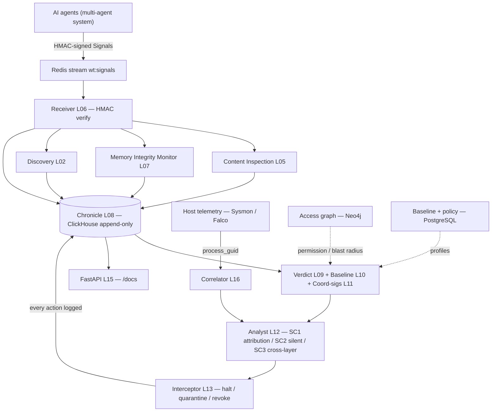
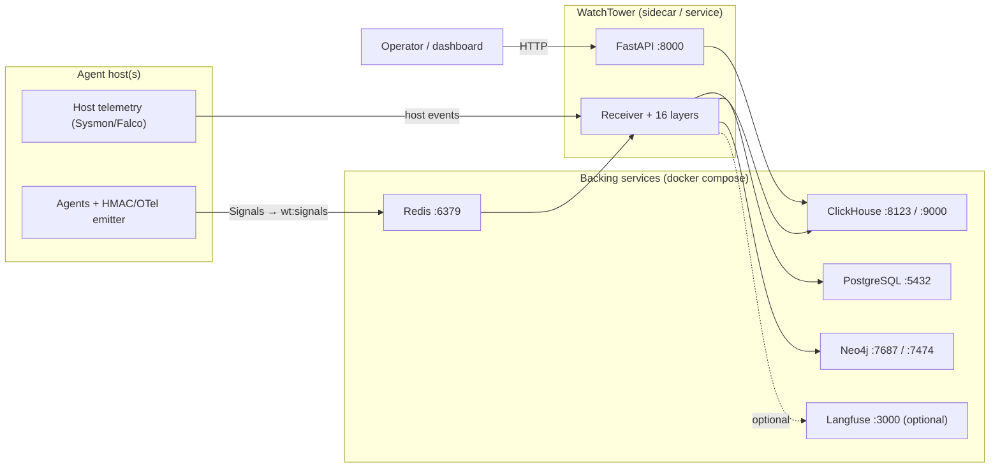

<div align="center">

```
 █████╗  ██████╗ ███████╗███╗   ██╗████████╗
██╔══██╗██╔════╝ ██╔════╝████╗  ██║╚══██╔══╝
███████║██║  ███╗█████╗  ██╔██╗ ██║   ██║
██╔══██║██║   ██║██╔══╝  ██║╚██╗██║   ██║
██║  ██║╚██████╔╝███████╗██║ ╚████║   ██║
╚═╝  ╚═╝ ╚═════╝ ╚══════╝╚═╝  ╚═══╝   ╚═╝
██╗    ██╗ █████╗ ████████╗ ██████╗██╗  ██╗
██║    ██║██╔══██╗╚══██╔══╝██╔════╝██║  ██║
██║ █╗ ██║███████║   ██║   ██║     ███████║
██║███╗██║██╔══██║   ██║   ██║     ██╔══██║
╚███╔███╔╝██║  ██║   ██║   ╚██████╗██║  ██║
 ╚══╝╚══╝ ╚═╝  ╚═╝   ╚═╝    ╚═════╝╚═╝  ╚═╝
```

**Security observability for multi-agent AI systems.**
*Trace every tool call. Attribute coordination failures. Catch silent failures and cross-layer discrepancies. Append-only forensic chronicle.*

[](https://www.python.org/downloads/)
[](#testing)
[](LICENSE)
[](https://clickhouse.com)

</div>

---

## What this is

WatchTower is an **observation-first** security platform for multi-agent AI systems. It instruments agent execution at the tool-call level and turns the resulting signal into forensic answers: *which* agent failed, *why*, *where in the call tree*, and *whether* a failure was silently swallowed. It is built as **16 sequential layers**, each gated by a test before the next is built.

It observes the three attack surfaces of agentic systems — input corruption, capability abuse, and multi-agent contagion — and records everything to an append-only Chronicle.

> **Enforcement lives in a companion repo.** WatchTower *observes*; the firewall that *acts* (interception, identity, policy DSL, cross-session taint, semantic verdicts) is **[agentwatch-firewall](https://github.com/beejak/agentwatch-firewall)**. That repo depends on this one as a library — the dependency is one-directional (firewall → watchtower); WatchTower never imports the firewall. Runtime order is firewall-intercepts-first, then watchtower-observes.

---

## Observability stack (16 layers)

| Component | What it does |
|-----------|-------------|
| `watchtower/core/` | Canonical `Signal` shape (defined once) + trace/event model |
| `watchtower/discovery/` | Active agent discovery; unknown agents flagged before they emit |
| `watchtower/receiver/` | Signal ingestion with per-emission origin verification (HMAC) |
| `watchtower/content_inspection/` | Injection / jailbreak / exfil pattern inspection (tier-0 filter) |
| `watchtower/memory_monitor/` | MINJA + SpAIware memory-integrity detectors |
| `watchtower/chronicle/` | ClickHouse append-only event store (no UPDATE/DELETE, 90-day TTL) |
| `watchtower/verdict/` | 3-stage verdict engine (deterministic → baseline → LLM judge) |
| `watchtower/baseline/` | Per-agent 3σ behavioral profiling (restricted until 50 traces) |
| `watchtower/coord_sigs/` | MAST + infrastructure coordination-failure signatures |
| `watchtower/analyst/` | SC1 attribution · SC2 silent-failure · SC3 cross-layer discrepancy |
| `watchtower/interceptor/` | Halt · quarantine · revoke_memory (every action chronicled) |
| `watchtower/api/` | FastAPI surface over the chronicle + verdicts |
| `watchtower/host_telemetry/` | Sysmon / Falco host-event correlation (process_guid) |

See [`SPEC.md`](SPEC.md) for the full layer/gate/invariant specification, and
[`ARCHITECTURE.md`](ARCHITECTURE.md) for the data-flow, signal shape, and chronicle schema.

---

## Tech stack

| Concern | Technology |
|---------|-----------|
| Language / runtime | **Python 3.12**, `asyncio` (all I/O is async) |
| Data model / validation | **Pydantic v2** — canonical `Signal` shape, defined once |
| API | **FastAPI** + **Uvicorn** (lifespan-managed) |
| Chronicle (audit store) | **ClickHouse** — MergeTree, append-only, 90-day TTL |
| Signal transport / bus | **Redis** streams (`wt:signals`, `wt:interceptor`) + pub/sub (`wt:memory_events`) |
| Behavioral baseline / policy | **PostgreSQL** (pgvector image) |
| Access graph / blast radius | **Neo4j** (bolt) |
| Tracing (optional) | **Langfuse** |
| Integrity | **HMAC-SHA256** signal signing; OTel-compatible signal fields |
| Verdict LLM judge (sampled, off hot path) | OpenAI-compatible client (e.g. DeepSeek) |
| Dev / CI | `uv`/`venv`, **Docker Compose**, `pytest`+`pytest-asyncio`+coverage, **GitHub Actions** |

## Architecture

Passive, append-only, side-car: agents emit HMAC-signed signals; WatchTower consumes,
analyzes, and records — without modifying the agents.



## How it works

1. **Emit.** Each agent step (tool call, LLM call, handoff, memory op) is emitted as a
   `Signal` (20 OTel-compatible fields), **HMAC-signed**, onto the Redis `wt:signals` stream.
2. **Verify + fan-out.** The Receiver checks the HMAC on *every* signal (reject if tampered),
   then fans out to discovery, content-inspection, and the memory-integrity monitor.
3. **Record.** Everything lands in the **append-only Chronicle** (ClickHouse) — no UPDATE,
   no DELETE, ever. This is the forensic source of truth.
4. **Judge + profile.** The verdict engine (deterministic → baseline → sampled LLM judge),
   per-agent behavioral baseline, and coordination-signature library run over the chronicle.
5. **Analyze.** The Analyst answers the three forensic questions — **SC1** (attribute a
   coordination failure to agent/action/call-tree position), **SC2** (silent failures that
   report success), **SC3** (agent self-report vs. host telemetry).
6. **Act + log.** The Interceptor can halt/quarantine/revoke; every action is itself
   chronicled. The FastAPI surface exposes traces, analyst results, and interceptor actions.

## What's needed to run it

- **Python 3.12** + the package (`pip install -e ".[dev]"` in a venv).
- **Backing services** (via `docker compose up -d`, or equivalents): Redis, ClickHouse,
  PostgreSQL, Neo4j. (A rootless single-binary ClickHouse suffices for the chronicle tests.)
- **Config is env-driven** (`watchtower/config.py`): point at any infrastructure via
  `CH_HOST`/`CH_PORT`/`CH_DB`/`CH_USER`/`CH_PASS`, `REDIS_URL`, `PG_DSN`,
  `NEO4J_URI`/`NEO4J_USER`/`NEO4J_PASS`, and `WT_HMAC_SECRET` (shared between emitting agents
  and the Receiver). Defaults match docker-compose for zero-config local dev.
- **Agent-side emitter**: agents must publish `Signal`s to `wt:signals` (an OTel exporter or
  the lightweight emitter in `agents/synthetic/`).
- **Optional**: an OpenAI-compatible `LLM_API_KEY` for the sampled verdict judge; host
  telemetry (Sysmon/Falco) feeding the correlator for SC3.

## Network / deployment



---

## Quickstart

```bash
# 1. Infrastructure
docker compose up -d redis clickhouse postgres neo4j

# 2. Install
python3 -m venv .venv && source .venv/bin/activate
pip install -e ".[dev]"

# 3. Run all gate tests (one per layer, gate-first, stop on first failure)
make gate-all

# 4. Full suite (203 tests, with coverage)
make test

# 5. Proof scenarios (SC1 coordination · SC2 silent failure · SC3 cross-layer)
make poc

# 6. API
make api          # http://localhost:8000/docs
```

---

## Testing

| Command | Scope |
|---------|-------|
| `make gate-NN` | Single layer gate (e.g. `make gate-08`) |
| `make gate-all` | All gates in order, stop on first failure |
| `make poc` | SC1 + SC2 + SC3 proof scenarios |
| `make test` | Full suite (203 passing) with coverage |
| `make benchmark` | LangSmith gap comparison |

CI runs the gates and proof scenarios against live Redis / ClickHouse / Postgres / Neo4j service containers on every push and PR.

---

## Security invariants

```
✦  Chronicle is APPEND-ONLY. No UPDATE. No DELETE. Ever.
✦  Signal origin is verified by the Receiver on every emission, not just the first.
✦  Verdict always carries score + source + reason — all three, always.
✦  Interceptor logs every action to the Chronicle. Never silent.
✦  Policy Engine is DEFAULT-DENY. Must be permitted, not merely not-forbidden.
✦  A new agent runs in restricted mode until 50 traces exist in its baseline.
✦  Memory writes are intercepted by the Memory Integrity Monitor before Chronicle.
✦  The LLM judge receives the Trace Summariser's output, never the raw trace.
```

---

## Infrastructure

| Component | Role | Port |
|-----------|------|------|
| Redis | Signal stream, interceptor bus | 6379 |
| ClickHouse | Chronicle — append-only, 90-day TTL | 8123 |
| PostgreSQL | Behavioral baseline, policy store | 5432 |
| Neo4j | Agent trust topology, blast radius | 7687 |

A rootless single-binary ClickHouse is sufficient for the chronicle tests if Docker is unavailable.

---

## Project structure

```
watchtower/          16-layer observability stack
tests/
├── gates/           one gate test per layer
├── poc/             SC1 / SC2 / SC3 proof scenarios
├── scenarios/       attack scenario tests
├── benchmark/       comparison harness
└── harness/         shared test harness
agents/
├── agentic_tester/  LLM-driven adversarial tester for the detectors
├── synthetic/       synthetic agent traffic generator
└── adversarial/     adversarial trace generators
paper/               research paper (replicated in the firewall repo)
docs/                documentation suite
```

---

## Research paper

The paper (observation-first agent security: taint propagation + semantic enforcement) lives in [`paper/`](paper/) and is replicated in the firewall repo. It spans both the observability and enforcement halves of the system; see the firewall repo for the enforcement implementation it evaluates.

---

## Citation

```bibtex
@misc{watchtower2026,
  title  = {WatchTower: Observation-First Agent Security —
            Taint Propagation and Semantic Enforcement in Multi-Agent Systems},
  author = {WatchTower Research},
  year   = {2026},
  note   = {Under submission. Observability: https://github.com/beejak/agentwatch ·
            Enforcement: https://github.com/beejak/agentwatch-firewall}
}
```

## Contributing

[CONTRIBUTING.md](CONTRIBUTING.md) — adding detectors, signatures, and new layers.

## License

MIT
